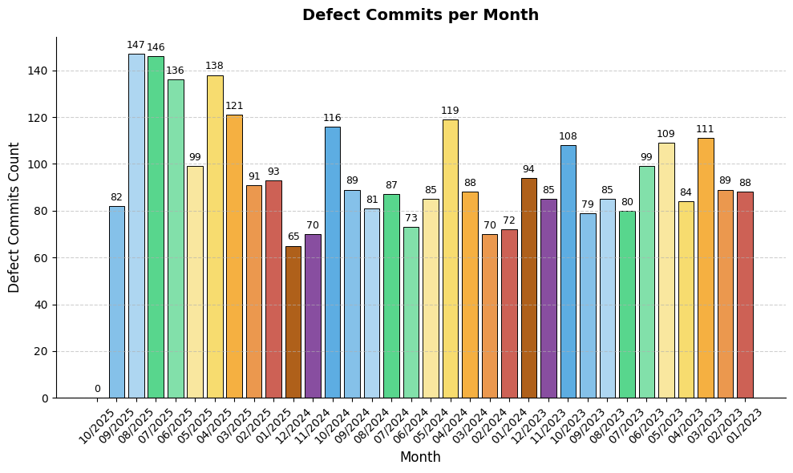
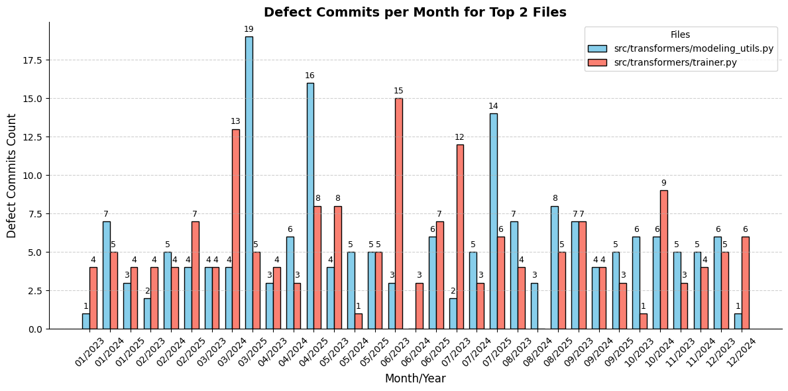
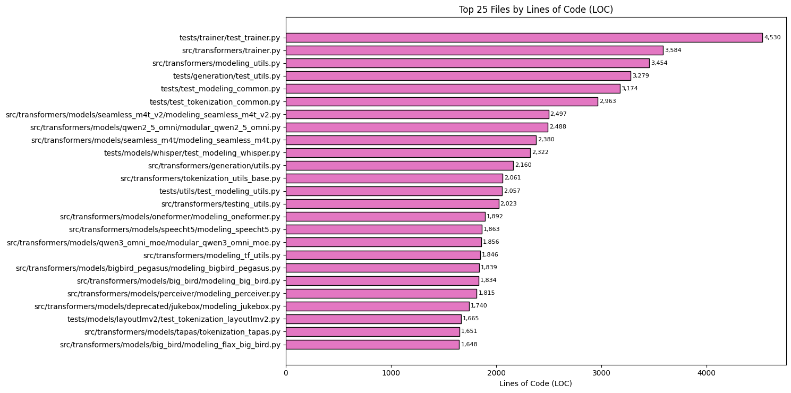
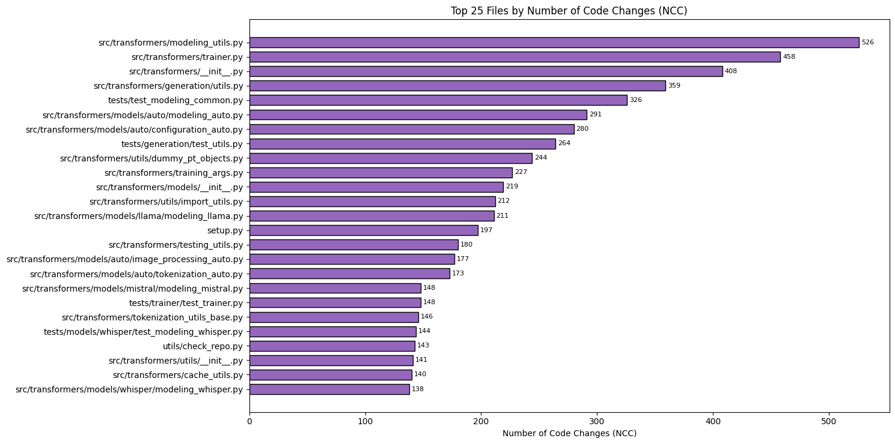
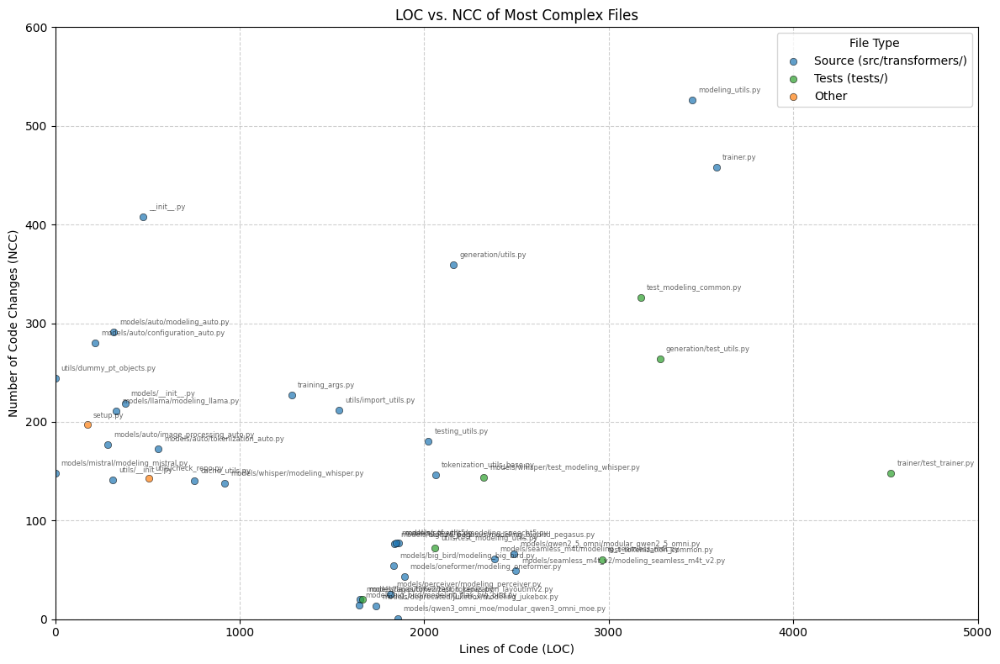
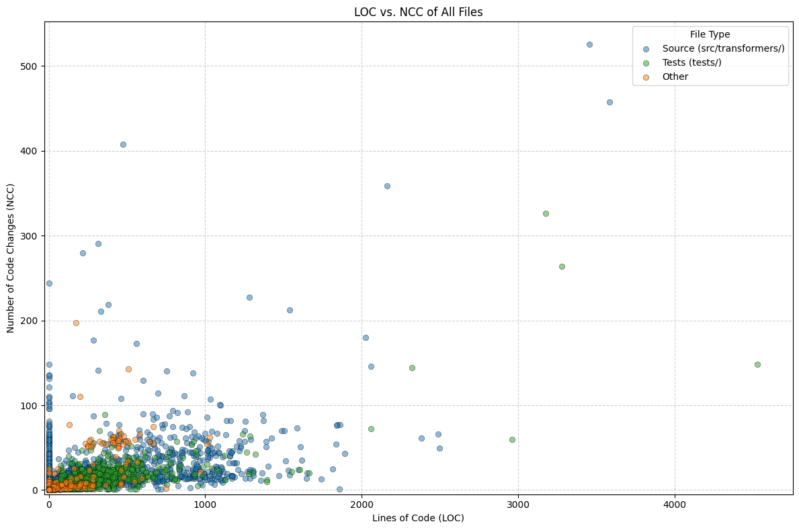
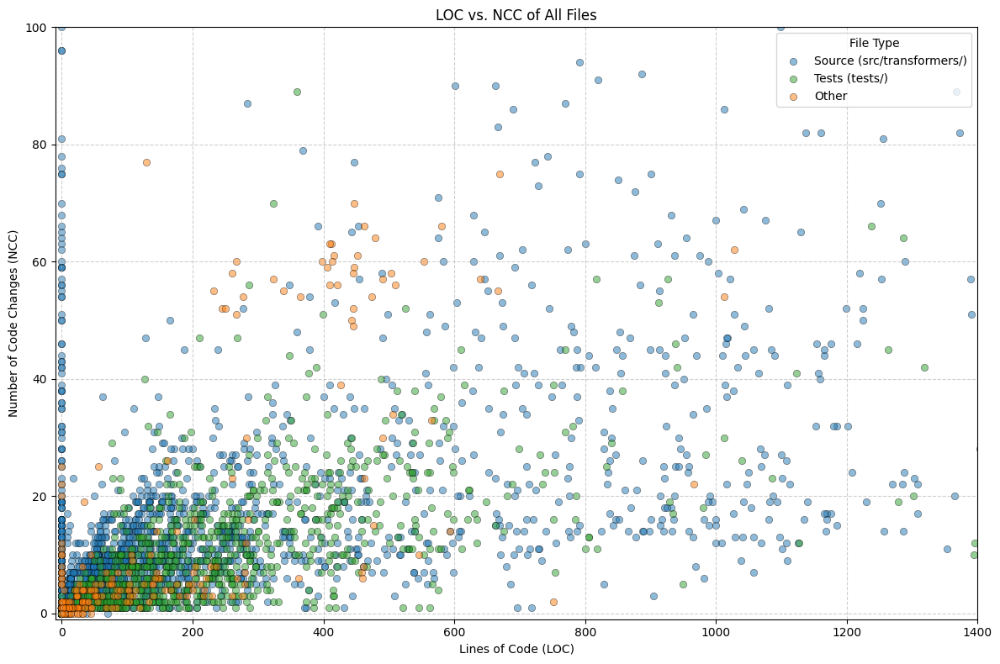
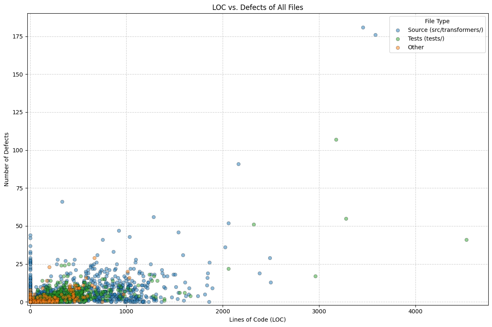
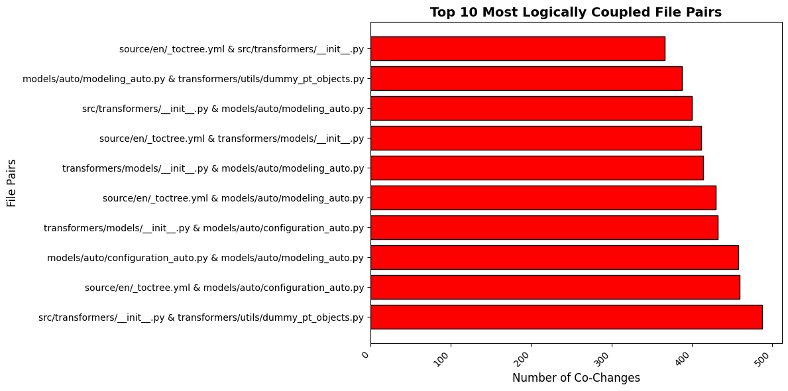
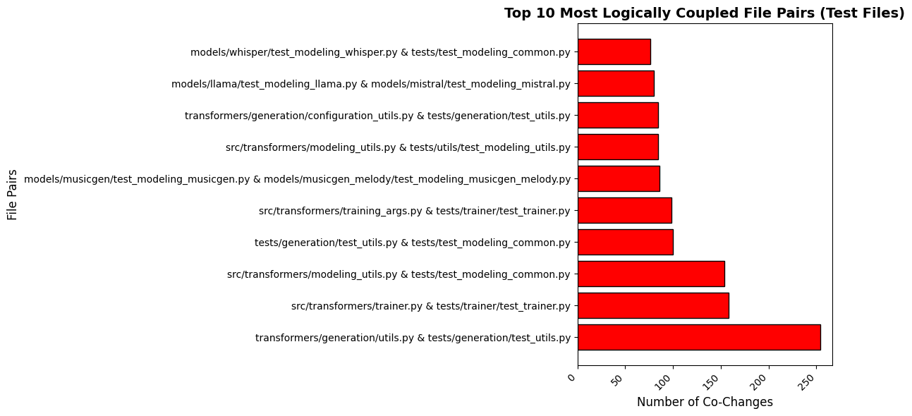

# Defect Analysis – Hugging Face Transformers

## Setup

First create the virtual env.

```shell
py -m venv .venv
pip install -r requirements.txt
```

Then clone the repo and generate the log file. This step can also be executed directly from `assignment.ipynb`

```shell
# Clone the transformers repository and checkout a specific version
git clone https://github.com/huggingface/transformers.git
cd transformers
git checkout v4.57.0
git tag --points-at HEAD

# Get git log of changes made after January 1, 2023
git log --name-only --pretty=format:"%ad - %an: %s" --after="2023-01-01" > ../git_log_output.txt
```

## Task 1

### Analyze these messages to detect the presence of specific keywords of your choice related to defect fixes

Our method for finding defective hotspots consist of checking for the substrings _fix_, _bug_, _error_, _issue_, _patch_ in the commit message. Our check is case insensitive, and is not restricted to full words so a message which contains _Fix:_ or _patched_ would also count as defect.

### Calculate and plot the total number of defects per month. Why do you think the number of defects dropped sharply in October 2025? Why did defects drop sharply in October 2025?

The repository is checked out at release tag v4.57.0, whose latest commit in October 3rd. We can see that in October 2025 there is only one commit. This explains why there are no defects in October 2025.



### Calculate and plot the number of defects per month for the two files with the highest number of defects



### In which month were the most defects introduced? How would you explain it? Manually examine the repository for that month (e.g., change logs, releases, commit messages) and come up with a hypothesis

March 2025 recorded the highest number of defect fixes (24 commits).
Historical data shows that March 2024 had an unusually high number of new features, many of which caused integration conflicts and latent bugs that reappeared a year later.

```log
MARCH 2025 DEFECT COMMITS

Mon Mar 31 23:31:24 2025 +0800 - cyyever: Fix more inefficient PT operations (#37060)
Mon Mar 31 17:02:49 2025 +0800 - huismiling: [MLU] Fix FA2 check error, remove deepspeed-mlu deps. (#36159)
Fri Mar 28 18:00:35 2025 +0100 - Cyril Vallez: Fix AttentionInterface following feedback (#37010)
Fri Mar 28 17:57:16 2025 +0100 - Cyril Vallez: Fix state_dict map location when quantized (#37086)
Fri Mar 28 16:36:44 2025 +0100 - Yih-Dar: fix tied weights issue (#37031)
Thu Mar 27 22:46:32 2025 +0800 - cyyever: Fix typing for None valued variables (#37004)
Wed Mar 26 16:24:57 2025 +0100 - Mohamed Mekkouri: Fix device_map check for ggml files (#37003)
Tue Mar 25 11:51:41 2025 +0100 - Marc Sun: Fix cuda index issue in cache allocator (#36937)
Tue Mar 25 10:43:27 2025 +0100 - Mohamed Mekkouri: Fixing _pre_quantization_dtype when torch_dtype is None (#36930)
Fri Mar 21 13:27:47 2025 +0100 - Raushan Turganbay: Fix: dtype cannot be str (#36262)
Fri Mar 21 10:11:47 2025 +0100 - Benjamin Bossan: FIX FSDP plugin update for QLoRA (#36720)
Thu Mar 20 11:55:47 2025 +0000 - Pavel Iakubovskii: Fix import for torch 2.0, 2.1 - guard typehint for "device_mesh" (#36768)
Tue Mar 18 18:46:03 2025 +0100 - Marc Sun: Fix casting dtype for quantization (#36799)
Fri Mar 14 17:36:02 2025 +0100 - Cyril Vallez: Fix post_init() code duplication (#36727)
Fri Mar 14 22:24:53 2025 +0900 - Sean (Seok-Won) Yi: Fix/best model checkpoint fix (#35885)
Thu Mar 13 21:47:35 2025 +0530 - Mehant Kammakomati: fix: fsdp sharded state dict won't work for save_only_model knob (#36627)
Thu Mar 13 22:27:50 2025 +0800 - wineandchord: fix type annotation for ALL_ATTENTION_FUNCTIONS (#36690)
Thu Mar 13 12:16:13 2025 +0100 - Marc Sun: Fix slicing for 0-dim param (#36580)
Wed Mar 12 11:40:46 2025 +0100 - Marc Sun: Fix bnb regression due to empty state dict (#36663)
Wed Mar 12 11:29:11 2025 +0100 - Arthur: fix block mask typing (#36661)
Mon Mar 3 18:35:37 2025 +0100 - Marc Sun: fix torch_dtype, contiguous, and load_state_dict regression (#36512)
Mon Mar 3 09:05:58 2025 -0500 - Zach Mueller: Fix loading zero3 weights (#36455)
Sun Mar 2 07:33:36 2025 +0000 - hlky: Fix _load_state_dict_into_meta_model with device_map=None (#36488)
Sat Mar 1 07:12:17 2025 +0100 - Marc Sun: Fix couple of issues from #36335 (#36453)
```

Based on these commit logs, the root cause of the spike in defects is not immediately clear without additional project context. However, cross-referencing the Hugging Face Transformers release history (PyPI: <https://pypi.org/project/transformers/4.49.0/#history>) provides useful insight:
v4.49.0 was released on February 17, 2025
v4.50.0 was released on March 21, 2025
Significant feature work and refactoring occurred between these two releases. The intense development period in late February and March likely introduced technical debt, which manifested as bugs soon after. Notably, 11 of the 24 fixes occurred after the v4.50.0 release, suggesting that the new release introduced regressions and integration issues that required immediate remediation. We assume thus the spike in March 2025 defects was primarily driven by heavy integration activity and major feature updates associated with the 4.50.0 release, leading to regressions and unstable components that required urgent post-release fixes.

### What are the limitations of this method for finding defective hotspots?

While our method is very inclusive and flags many commits as defects, the main limitation is that there may be false positives. As we check for substrings, there may be messages that are flagged because of unintended words like _fixation_ for example. Also, a commit may not actualy fix a bug, but includes in its message any of our selected words.

## Task 2

### Select two complexity metrics of your choice

We have selected Lines of Code (LOC) and Number of Code Changes (NCC) as our complexity metrics, as we felt they represent very different things. We also considered Cyclomatic Complexity, but most of the libraries calculate by code block, so to obtain a single number by file we would have to aggregate it. Considering this, we felt that LOC is simpler to understand and is a better gauge for the complexity of a file.

### Calculate LOC and NCC of all .py files

For calculating LOC we used the library [pygount](https://pypi.org/project/pygount/) which calculates the number of source lines of code, excluding blank lines and comments. For the NCC we considered **all commits**, not only defect commits, between 2023-01-01 up until release v4.57.0.

### Visualize the complexity hotspots

We used 2 bar charts to view the top 25 most complex files by LOC and by NCC.




We also used a scatterplot to visualize both metrics at the same time, combining the previous top 25s. In the scatterplot there are 41 files, as 9 files appear in both tops. Additionally, the points are color coded by their type, based on their location. We distinguish between source files which are in src/transformers (src folder solely contains the folder transformers), test files which are in test/, and all other files.



### What can you say about the correlation between LOC and NCC?

If we use the scatterplot visualization, this time with all the files in the repository, we can see that most files are not complex and are in the same area. There is only a handful of files with extreme LOC and NCC. From this overview we can not appreciate any correlation. Notably, there are many files with 0 NCC, regardless of their LOC.



If we leave out the most complex files, and zoom in where the majority of files (under 1400 LOC and 100 NCC) we can still see points all over the place. We can not still appreciate any correlation.



### "Files with higher complexity tend to be more defective"

For judging this claim we will consider only LOC, as NCC and number of defects are highly correlated on most files. For this, we used again the scatterplot visualization and we can see a shape very similar to the last visualization. In this case there is even less correlation, as there are a considerable number of files with +1000 LOC with 0 defects. We then reject this claim. Of course, we can still find individual files with high complexity and number of defects, but we can also find complex files with low number of defects, and simpler files with a high number of defects.



## Task 3

### Calculate the logical coupling for each file pair in the repository

In order to solve this task, I've created an object to represent the `Logical Coupling` as a structured way to encapsulate all the data and behaviour related to calculating and visualizing logical coupling between files.

This design makes the code reusable and easier to maintain, since the logical coupling logic isn't scattered accross the program, and it can be instantiated in multiple scenarios (i.e: without including the test files).

The `__init__.py` file in the transformers package defines a dictionary called `_import_structure`, which specifies the base objects and modules that are exposed by the package. It defines which base objects are exposed by the package.

The `dummy_pt_objects.py` file, on the other hand, defines the objects that `_import_structure` references.



### Consider only file pairs where the one file is a Python test file

### How would you explain this type of coupling?

This type of logical coupling reflects the relationship between tests and the code they verify. When a non-test file changes, developers often update the corresponding test to reflect the changes. The test is coupled to the implementation it verifies.

### Is it a code smell that requires attention and signals potential refactoring opportunities or is it something different?

This is not a code smell. As shown in the figure, the top 10 most logically coupled pairs include a test file and the code it verifies. This indeed shows the dependency between tests and the functionality they cover. It indicates **actively maintainance of the tests** rather than a design problem.



### Discuss at least three (3) methods for selecting the most “related” test file given a (non-test) .py file

- ### Method 1: Import Analysis

The first method identifies the most related test files through the analysis of the file's imports. In this approach, all test files in the project are inspected to determine which production modules they reference through their import statements. Because unit tests import the functions, classes or modules aimed to verify, is possible to track from a given source file which test file is meant to cover.

- ### Method 2: Files Coupling

This second method, instead relies on logical coupling between a test file and a non-test file exactly as done in the past section of the third exercise. From the Git commit log, it is possible to count how many times both a test and a non-test file have been modified together. For a input `.py` file, the most related file is therefore the one with the highest co-change count.

- ### Method 3: Semantic Similarity

This third method uses natural language similarity between the implementation file and test file names, class name or identifiers. Instead of relying on imports or commit history, this method compares natural-language information extracted from filenames, class names. The intuition is that normally test files often contain naming patterns derived from the modules they test such as: `test_example.py` corresponds to the production module `example.py`.

### Select two of the three test placement methods you proposed above and implement them in Python

### Where would the two methods place automatically generated tests for src/transformers/generation/utils.py?

Both methods would place the automatically generated test for `src/transformers/generation/utils.py` at `tests/generation/test_utils.py`.

This is because both the directory mirroring method and the filename-based method generate a test file in the `tests/` directory that mirrors the source file’s path and prefixes the filename with `test_`

## Declaration of AI use

Generative AI was used to assist the coding of this assignment.

> At first, I was not knowledgeable enough to create the bar plot by myself, so I went to the Matplotlib documentation for bar plot generation (https://matplotlib.org/stable/gallery/lines_bars_and_markers/bar_colors.html#sphx-glr-gallery-lines-bars-and-markers-bar-colors-py), but the plot was not optimal, so I initiated the following conversation with ChatGPT: Given the following code, generate me a colorful and clearer visualization. I used ChatGPT for both tasks 1.3 and 1.4, both for visualization generation and refactorization.
> I also used Generative AI to clean my code. Initially, I wrote a big function with many implementations in it, with issues such as code duplication and poor code design. As I was writing and adding the code based on the exercises, a lot of code piled up to the point where it was quite complicated to continue without touching other implementations within the same function. To better solve the issue of coupling, I asked ChatGPT to help me better organize the function, so I initiated the following conversation: Structure and clean the following code, xxx. ChatGPT then reorganized the code into multiple small functions, allowing me to implement and reuse different parts without complex interactions. I then continued based on the structure and added other functions.

> I am analyzing a code repository and I have the git traces. I have a metric for the complexity of each file. Give me examples of visualizations which show which parts of the code base are more complex?

> Give the command that generates a git log which includes the date, the message of the commit and the file names

> Create a python script that traverses a python git repository, and calculates the number of lines of code per file
>
> Yeah, calculate instead source lines of code
>
> Can you use a library instead

> It makes sense when checking for the files coupling to find the exact file path of a given .py file? Because it is possible that there are out there multiple files with the same name, such it happens with `__main__.py`
> Ah, I see exactly what you’re getting at. Yes — your intuition is correct: just using the file name (like example.py or `__main__.py`) can be risky because there might be multiple files with the same name in different directories. That can easily lead to false matches in your logical coupling analysis.
> When looking for the respective test file from an inputed .py file by the method of Semantic Similarity, the files inside the `example/` directory are not mirrored into the `tests/` directory. Therefore it is a good idea to skip them?
> Yes — in this case, skipping files in the example/ directory makes sense, because if the directory structure isn’t mirrored in tests/, trying to map example/foo.py → tests/example/test_foo.py would almost always fail. Including them could lead to false negatives or unnecessary errors when looking for a corresponding test file.
