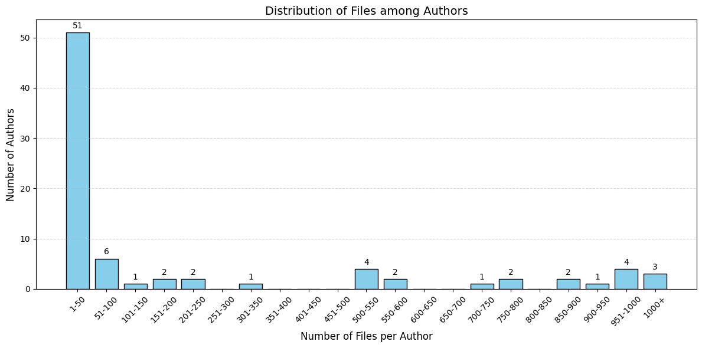
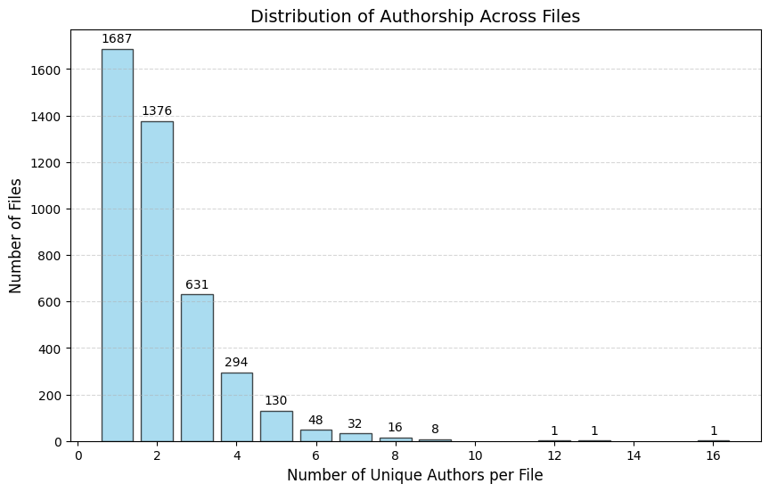
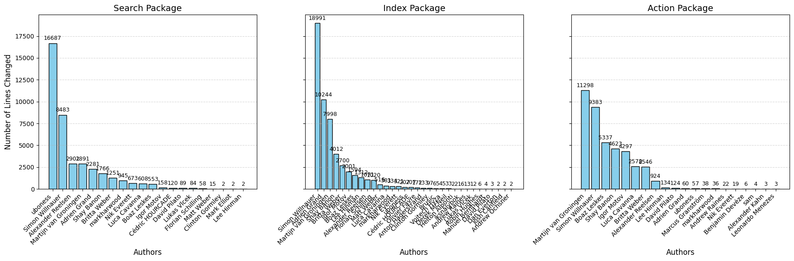
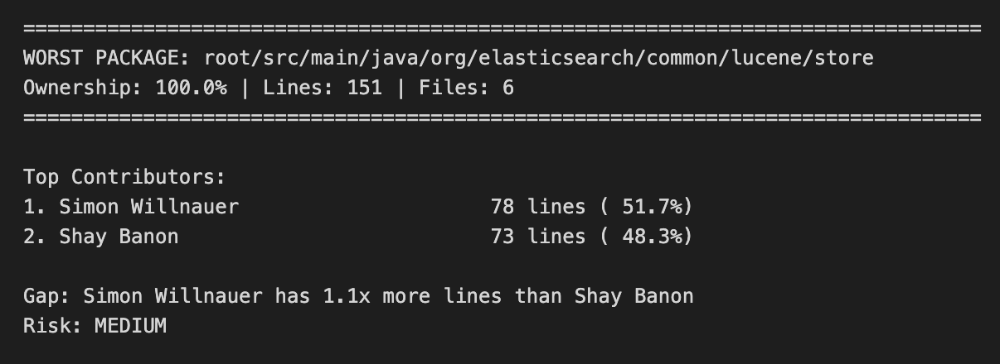

# Defect Analysis – Hugging Face Transformers

## Setup

First create the virtual env.

```shell
py -m venv .venv
pip install -r requirements.txt
```

Then clone the repository and place it inside the `ass2/` directory

```shell
# Clone the elasticsearch repository and checkout a specific version
git clone https://github.com/elastic/elasticsearch.git
```

## Task 1

### Visualize the distribution of files among authors

The `author_modified_files` map is gathered by traversing the commits. The keys are the authors and the values are the number of modifications they made. Moreover, as the data follows a Power Law distribution, we've distributed it among the different cut-offs (bins) to make it more visual.



### Visualize the distribution of authors among files

The `file_authors` map counts the contributions for each file. The keys are the file paths and the values are lists of authors who modified that file. Note that the list may contain repeated authors.



### Comment the two distribution visualizations.

The majority of authors (51) have modified only 1 to 50 files, while most files have been modified by one (1687 files), two (1687 files) or three (631 files) authors.

It is important to highlight that 7 authors have individually modified more than 900 files. Moreover, 16 authors have modified only 1 file.

In conclusion, most of the files have been modified by one, two or three authors, and in general, the majority of authors have commited to only 50 files or less.

### Visualize the author contributions (lines added + lines removed)

The `author_line_changes` is gathered by traversing the commits of the repository. The keys are the authors' names and the values are the number of line changes (which can be added, removed, total, or diff lines depending on the `Modification` type)

To compute the value at the package level, I aggregate the data per file by iterating through the modified files in each commit. I only consider the files where the path starts with the given `package_path`.



### Compare the visualization for the 3 packages and comment.

The number of lines changed varies drastically between the packages. We can distinguish between two types of contributors: those who are active across the entire system and those who focus their effort on a specific package.

For example, Simon Willnauer, Martijn van Groningen, and Shay Banon have contributed significantly to all of them. However, it is important to highlight that other authors specialize in single areas. A clear example is uboness: while they are the top contributor in the Search Package, they have only contributed 60 lines to the Action Package.

## Task 2

### For the package you identify as the worst in terms of knowledge loss



The worst package with multiple contributors is org/elasticsearch/common/lucene/store (151 lines). Contributors:

- Simon Willnauer: 78 lines (51.7%)
- Shay Banon: 73 lines (48.3%)

### Gap Analysis

The gap between Simon and Shay is small (5 lines). This means the knowledge in this package is almost evenly split between them, which is actually not bad.
Looking at the bigger picture, both are major players in the project: Simon has worked on 7,245 files total, while Shay has touched 1,658 files. So we're talking about two experienced developers who both know this package well.

### Risk Assessment

Even though individual files tend to have a single owner, the overall package knowledge is well-balanced between Simon and Shay. The tiny 1.1x gap means if one of them leaves, the other already understands nearly half the code—not ideal, but definitely manageable. There's enough overlap that the team wouldn't be starting from scratch.

## Task 3

## Declaration of AI use

Generative AI was used to assist the coding of this assignment.

### Task 1 AI use

> How can I enhance the distribution of files among authors chart? Most of the data is distributed between the 100 number of files per author and there're values up to 7,000!!

> To handle data that clusters heavily under 100 but stretches all the way to 7,000, a standard linear chart (bins of 50) fails. You end up with one giant bar at the start and a lot of empty space, or an invisible bar at 7,000.

The professional way to visualize this Power Law distribution is to use Logarithmic Bins (or "Variable Width Bins").

### Task 2 AI use

For this task, I used AI to check and correct my code when creating the tree structure for output.json and when finding the worst package within the team. The usage was mainly inspirational and helped guide me through my coding errors. For the tree structure, since it iteratively retrieves and organizes data into different hierarchies, I made some mistakes in between, causing erroneous output for output.json. I asked Claude AI to point out where I went wrong and corrected my code afterward. For the worst package within the team, the help was more inspirational. At first, I wasn't sure what approach to take for the task, so I asked Claude AI to give me some raw ideas without providing the solution, mainly guiding me through it.

### Task 3 AI use
